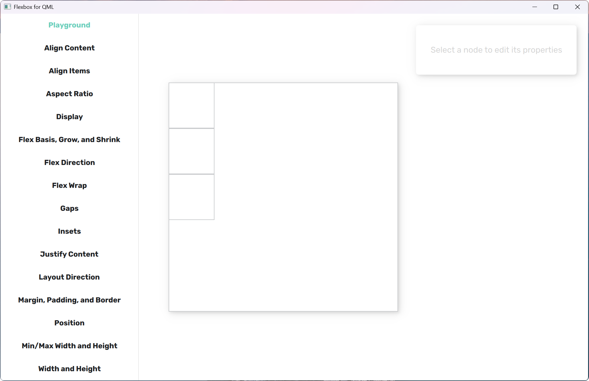
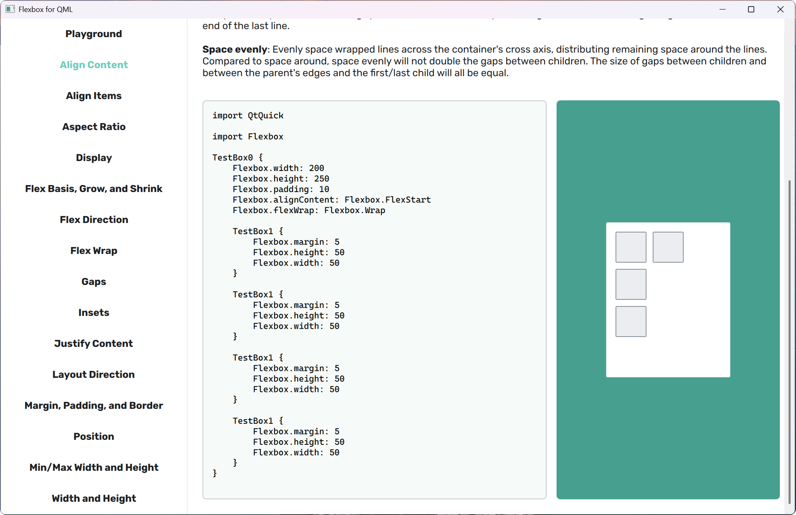
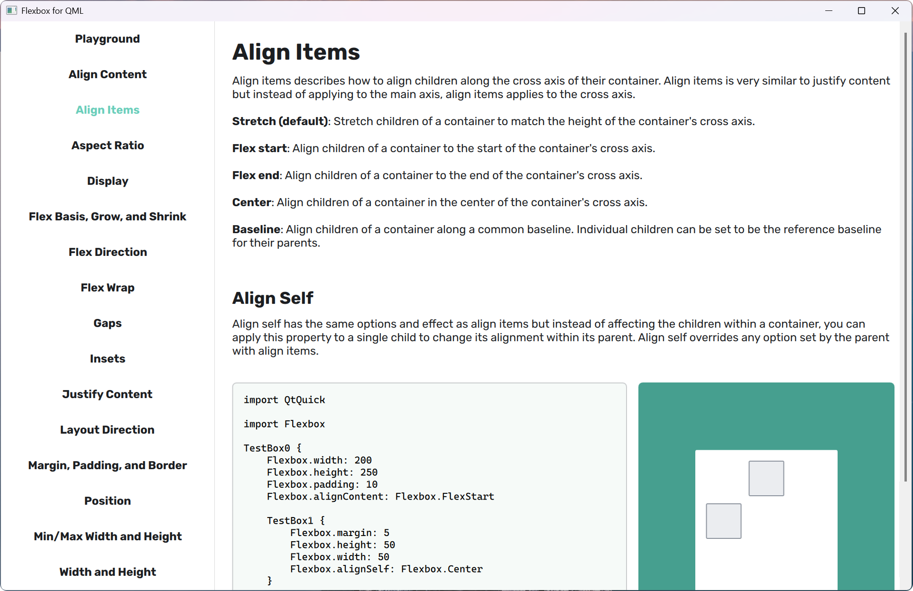

# Flexbox for QML

QML `Flexbox` is an attached property powered by [Yoga Layout 3](https://www.yogalayout.dev/) that lets you build layouts in QML using a flexbox-style model.

It exposes Yoga’s layout capabilities as declarative properties that can be attached to any visual item and controlled entirely from QML.

The demo application showcases the full feature set: direction, alignment, wrapping, gaps, margins, padding, borders, width/height, and more.





---

## Overview

In QML, `Flexbox` is used as an **attached property** on visual items such as `Item` or `Rectangle`:

- Direction: `Flexbox.direction`, `Flexbox.flexDirection`, `Flexbox.flexWrap`
- Alignment: `Flexbox.justifyContent`, `Flexbox.alignItems`, `Flexbox.alignContent`, `Flexbox.alignSelf`
- Size: `Flexbox.width`, `Flexbox.height`, `Flexbox.minimumWidth`, `Flexbox.maximumHeight`, `Flexbox.aspectRatio`
- Box model: `Flexbox.margin`, `Flexbox.padding`, `Flexbox.border`, plus per-edge / horizontal / vertical variants
- Gaps between items: `Flexbox.gap`, `Flexbox.rowGap`, `Flexbox.columnGap`
- Flex behavior: `Flexbox.flex`, `Flexbox.flexGrow`, `Flexbox.flexShrink`, `Flexbox.flexBasis`

All of these map directly to Yoga’s layout model; you configure them from QML without needing to care about the internal implementation.

---

## Basic examples

### 1. Simple horizontal layout

```qml
Item { // horizontal container, children share the remaining space
    width: 400
    height: 100

    Flexbox.flexDirection: Flexbox.Row

    Rectangle {
        color: "#6bcebb"
        Flexbox.flexGrow: 1
    }

    Rectangle {
        color: "#f3a33b"
        Flexbox.flexGrow: 1
    }

    Rectangle {
        color: "#4a90e2"
        Flexbox.flexGrow: 1
    }
}
```

### 2. Vertical layout with padding and gaps

```qml
Item { // vertical stack with padding and gaps
    width: 300
    height: 200

    Flexbox.flexDirection: Flexbox.Column
    Flexbox.padding: 16
    Flexbox.gap: 8

    Rectangle {
        Flexbox.height: 40
        radius: 4
        color: "#ffffff"
    }

    Rectangle {
        Flexbox.height: 40
        radius: 4
        color: "#ffffff"
    }
}
```